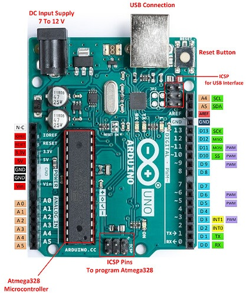

# Bare Metal Programming For ATMEGA-328P
Contains the following sketches:
- LED blinking with delay.
- Input pin configuration.
- Enabling interrupts.
- USART driver.
- Timers.
- Analog Read.

Used as a reference for future and personal learning.

## Board
<p align="center">

</p>

## Blinky
In this sketch, the pins are configured to send out output using registers.  
Use the DDR (Data direction registers) for port D.
```c
  // Set pin mode to output
  // DDR D is the Data direction register
  // port D which contains values from 0-7
  // Port D, data direction for pin 2
  // 0 means input and for output, the bit needs to be 1
  DDRD |= (1 << DDD2);
```
To set the pin to HIGH use the OR operator `PORTD |= (1 << PORTD2)`
  
To set it to LOW use AND operator with NOT `PORTD &= ~(1 << PORTD2)` use XOR to toggle with just one line of code `  PORTD ^= (1 << PORTD2)`

## Input
To use the pin as input set the DDR value to 0 instead of 1.
```c
  // input pin mode, 0 in bit 2
  DDRD &= ~(1 << DDD2);
  // set internal pull up by setting 1 to PORTD2
  PORTD |= (1 << PORTD2);
```
In order to read the value in loop, use PIN not PORT.
```c
  if (PIND & (1 << PIND2)) {
    PORTD |= (1 << PORTD4);
  }
  else {
    PORTD &= ~(1 << PORTD4);
  }
```
> For Input use PIN and for output use PORT

## Timer
The ATmega328P has three hardware timers, timer 0 (8-bit), timer 1 (16-bit), and timer 2 (8-bit).  
They run independently of your loop() code in the background.

This sketch uses timer 1 (16-bit) with ISR.
- Set timer 1 to CTC mode (Clear Timer On Compare Match).
```c
  TCCR1A = 0;
  TCCR1B = 0;

  // Set Timer 1 to CTC Mode (Clear Timer on Compare Match)
  // WGM12 bit turns on CTC mode
  TCCR1B |= (1 << WGM12);
```
- Configure the prescaler to 256
```c
  // 256 prescaler
  TCCR1B |= (1 << CS12);
  TCCR1B &= ~(1 << CS11);
  TCCR1B &= ~(1 << CS10);
```
- Set timer count to '0' and compare value to number
```c
  // set timer count to 0 and compare value to our number
  TCNT1 = 0;
  OCR1A = time_compare;
```
> time compare variable is a global constant `const uint16_t time_compare = 31250;`
- Enable global interrupts: `sei();`

**ISR**
Upon the interrupt flip the output PIN
```c
ISR(TIMER1_COMPA_vect) {
  // flip
  PORTB ^= (1 << PORTB1);
}
```

## USART Driver
The sketch is in file `RxTxInterrupt.ino` this contains ISR based receive and transmission.

- Setup
```c
void setup()
{
  // baud rate
  UBRR0H = 0;
  UBRR0L = 103;

  // Enable receiver and transmitter
  UCSR0B = (1 << RXEN0) | (1 << TXEN0) | (1 << RXCIE0);
  UCSR0C = 0;

  // format
  UCSR0C = (1 << UCSZ01) | (1 << UCSZ00);
  UCSR0C &= ~(1 << USBS0);
}
```
> Agree on a baud rate, enable transmitter and receiver, pick a format from data sheet.

- Echo function acts as wrapper for filling up buffer with message and kicks of transmission by pushing first byte into `UDRO` register and flipping `UDRIE0` bit in `UCSR0B` register.
```c
void echo(const char* msg)
{
  while (*msg != '\0' && tx_buffer_index < buffer_size)
  {
    tx_buffer[tx_buffer_index++] = *msg++;
  }

  // If transmitter idle, kick it off
  if (!(UCSR0B & (1 << UDRIE0)))
  {
    tx_tail = 0;
    UDR0 = tx_buffer[tx_tail++];
    UCSR0B |= (1 << UDRIE0);
  }
}
```
- Transmission ISR
```c
ISR(USART_UDRE_vect)
{
  if (tx_tail < tx_buffer_index)
  {
    UDR0 = tx_buffer[tx_tail++];
  }
  else
  {
    tx_buffer_index = 0;
    tx_tail = 0;
    UCSR0B &= ~(1 << UDRIE0); // disable interrupt
  }
}
```
- Receive ISR
```c
ISR(USART_RX_vect)
{
  char rx_byte = UDR0;
  rx_buffer[rx_buffer_index] = rx_byte;

  if (rx_byte == '\r' || rx_byte == '\n')
  {
    rx_buffer[rx_buffer_index] = '\0';
    echo("You sent: ");
    echo(rx_buffer);
    echo("\r\n");
    rx_buffer_index = 0;
  }
  else
  {
    ++rx_buffer_index;
    if (rx_buffer_index >= buffer_size - 1) // leave space for '\0'
    {
      rx_buffer_index = 0;
    }
  }
}
```

## Custom Millis
- Make a variable to keep track of system time `volatile unsigned long system_millis = 0;`
- Initialize timer
```c
void initTimer0() {
    // Set Timer0 to CTC mode (Clear Timer on Compare Match)
    TCCR0A = (1 << WGM01);
    
    // Set prescaler to 64 and start the timer
    TCCR0B = (1 << CS01) | (1 << CS00);
    
    // Load the compare value for 1ms intervals (249)
    OCR0A = 249;
    
    // Enable Timer0 Compare Match A interrupt
    TIMSK0 = (1 << OCIE0A);
    
    sei();
}
```
- ISR which increments counter every 1 ms
```c
// Timer0 CTC, fires every 1 ms
ISR(TIMER0_COMPA_vect) {
    system_millis++;
}
```
- A read function to get current milliseconds
```c
// Atomic read of 32-bit variable
unsigned long custom_millis() {
    unsigned long m;
    cli(); // Clear interrupts temporarily to safely read 4 bytes
    m = system_millis;
    sei(); // Restore interrupts
    return m;
}
```
**Bonus: Delay Function**
```c
void custom_delay(unsigned long ms) {
    unsigned long start = custom_millis();
    while (custom_millis() - start < ms) {
        // Wait loop
    }
}
```

